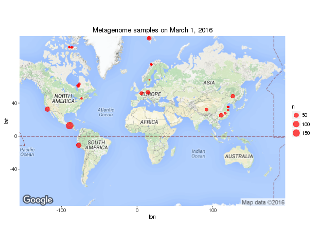

`ENAbrowseR` is an `R` package to search and retrieve reports from the [European Nucleotide Archive](http://www.ebi.ac.uk/ena/browse/programmatic-access) Browser REST URL. 

###Installation

```
library(devtools)
install_github("cstubben/ENAbrowseR")
```

###Search

`ena_taxonomy` accepts either a taxonomy ID or name as input and returns the number of records and size of each sequence database (total bases) on the ENA [taxonomy page](http://www.ebi.ac.uk/ena/browse/taxon-portal-rest).  The report includes direct hits to the taxa (*Yersinia pestis*) and hits to all descendants (all strains of *Yersinia pestis*). 

```
ena_taxonomy("Yersinia pestis")
Yersinia pestis, Taxid:632

                  direct   size subtree subsize
analysis               0      -       0       -
analysis_study         0      -       0       -
assembly              17  80 Mb     282    1 Gb
coding_release     56749  52 Mb  637112  549 Mb
coding_update          3   2 Kb   37902   35 Mb
noncoding_release   1267 448 Kb   12798    3 Mb
noncoding_update       1    490     832  333 Kb
read_experiment      254 295 Gb     406  428 Gb
read_run             254 295 Gb     427  428 Gb
read_study            20 295 Gb     104  428 Gb
read_trace             0      -  579465       -
sample               219      -     359       -
sequence_release    2001  94 Mb  189998    1 Gb
sequence_update      131  14 Mb     162   56 Mb
study                 50      -     192       -
tsa_set                0      -       0       -
wgs_set                7      -     243       -
```


The `usage` dataset lists further details about the result databases above, columns for filtering and returnable fields.  These tables are also found on the ENA [usage page](http://www.ebi.ac.uk/ena/data/warehouse/usage).  

```
data(usage)
usage$results
              Result                                                Description
1           analysis                    Nucleotide sequence analyses from reads
2     analysis_study Nucleotide sequence analyses from reads (grouped by study)
3           assembly                                          Genome assemblies
4     coding_release                         Protein-coding sequences (Release)
5      coding_update                          Protein-coding sequences (Update)
...

subset(usage$columns, grepl("assembly", Result), 1:3)
                   Column                  Type                                Description
1               accession                  text                           accession number
10         assembly_level controlled vocabulary                             assembly level
11          assembly_name                  text genome assembly name for all live versions
12         assembly_title                  text          brief genome assembly description
13             base_count                number                       number of base pairs
51  genome_representation controlled vocabulary   whether this is a full or partial genome
107      sample_accession                  text                    sample accession number
124                strain                  text      strain from which sample was obtained
125       study_accession                  text                     study accession number
127     study_description                  text      detailed sequencing study description
128            study_name                  text                      sequencing study name
129           study_title                  text         brief sequencing study description

usage$fields$assembly
 [1] "accession"             "study_accession"       "sample_accession"      "assembly_name"         "assembly_title"        "study_name"           
 [7] "study_title"           "study_description"     "tax_id"                "scientific_name"       "strain"                "base_count"           
[13] "assembly_level"        "genome_representation"
```

`ena_search` returns a tab-delimited report from one of the 18 result databases (default is sample).  A valid [search query](http://www.ebi.ac.uk/ena/browse/search-rest) is required, for example use `tax_tree(632)` to list all 282 *Y. pestis* assemblies.   

```
yp <- ena_search("tax_tree(632)", result= "assembly") 
282 rows

table(yp$assembly_level)
     chromosome complete genome          contig        scaffold 
              6              32             205              39 
```


`ena_search` will return all 14 fields listed in `usage$fields$assembly` and drop any empty columns by default.  You can also specify columns or change the limit of 10000 records. 

```
ena_search("tax_tree(632)", result= "assembly", fields=c("study_accession", "scientific_name"), limit=10, showURL=TRUE) 
http://www.ebi.ac.uk/ena/data/warehouse/search?query=tax_tree(632)&result=assembly&fields=study_accession,scientific_name&limit=10&display=report
10 rows

       accession study_accession                            scientific_name
1  GCA_000006645        PRJNA288                     Yersinia pestis KIM10+
2  GCA_000007885      PRJNA10638 Yersinia pestis biovar Microtus str. 91001
3  GCA_000009065         PRJNA34                       Yersinia pestis CO92
4  GCA_000013805      PRJNA16646                   Yersinia pestis Nepal516
5  GCA_000013825      PRJNA16645                    Yersinia pestis Antiqua
6  GCA_000016445      PRJNA16700                Yersinia pestis Pestoides F
7  GCA_000018805      PRJNA16067                     Yersinia pestis Angola
8  GCA_000022805      PRJNA36507                    Yersinia pestis D106004
9  GCA_000022825      PRJNA36545                    Yersinia pestis D182038
10 GCA_000022845      PRJNA36547                    Yersinia pestis Z176003
```


If you need to download more than the maximum 100,000 records, use `offset` to get the next 100,000 records (and set `drop=FALSE` to keep all 68 columns for merging).  `ena_search` also has a `resultcount` option to count the number of results if needed.   In this example, the 316,311 metagenome samples are combined into a single `data.frame`.  

```
ena_taxonomy("metagenomes")
metagenomes, Taxid:408169
                  direct size   subtree subsize
...
sample              2963    -    316311       -

ena_search("tax_tree(408169)", resultcount=TRUE)
[1] "Number of results: 316,311"

m1 <- ena_search("tax_tree(408169)", limit=100000, drop=FALSE)
m2 <- ena_search("tax_tree(408169)", limit=100000, drop=FALSE, offset=100001 )
m3 <- ena_search("tax_tree(408169)", limit=100000, drop=FALSE, offset=200001 )
m4 <- ena_search("tax_tree(408169)", limit=100000, drop=FALSE, offset=300001 )

mg <- rbind(m1, m2, m3, m4)

 table(substr(mg$first_public, 1,4))
   2010   2011   2012   2013   2014   2015   2016 
  63483  12409  11726  28390  64606 114130  21567 
```


The rest of the guide uses a list of metagenome samples released on March 1, 2016.  

```
m1 <- ena_search("tax_tree(408169) AND first_public=2016-03-01")
Dropping 40 empty columns
1014 rows
```


`summary_ena` returns the number of unique and total annotations in the table.

```
summary_ena(m1)
                           unique total
accession                    1014  1014
secondary_sample_accession   1014  1014
sample_alias                 1010  1014
description                   260  1014
location                      152   409
collection_date                58   636
isolate                        45    44
depth                          29   104
environment_feature            27   434
country                        20   636
center_name                    19  1014
...
```


`table2` is a wrapper to `table` and displays the sorted results as a `data.frame`

```
table2(m1$country)
                              n
El Salvador                 153
China                       119
Peru: Lima                   55
Pacific Ocean                52
Svalbard: Foxfonna Ice Cap   37
China:Hunan                  35
Czech Republic               35
China: Heilongjiang, Suihua  30
Canada:Kuujjuarapick         26
France:Neuves-Maisons        23
```


Environmenal biomes, features or material often display the [ENVO](http://www.environmentontology.org) ID number only like ENVO:01000005, 01000005  or 1000005.  Find matching names in the `envo` dataset using the 8 digit ID.

```
table2(m1$environment_feature)
                                  n
human gastric mucosa            119
1000005                          52
composting latrine chamber       35
pond                             34
household washing place          29
latrine urine exit               24
PAH-contaminated soil            23
adjacent to latrine compartment  22
animal feces                     18
street-access sewage             16


data(envo)
subset(envo, id=="01000005")
           id      name
1297 01000005 upwelling
```


Countries are often missing location data to plot on a map.  The `geocode` function in `ggmap` allows users to geocode up to 2500 locations per day using the Google Maps API. 

```
library(ggmap)
z1 <-  unique(m1$country[m1$location=="" & m1$country!=""] )
[1] "USA: South Burlington"       "El Salvador"                 "Peru: Lima"                  "China:Qinghai_tibet_Plateau"

y <- geocode(z1, output="more")
y[,1:5]
        lon       lat            type     loctype                                 address
1 -73.17096  44.46699        locality approximate               south burlington, vt, usa
2 -88.89653  13.79419         country approximate                             el salvador
3 -77.04279 -12.04637        locality approximate                              lima, peru
4  92.00000  33.00000 natural_feature approximate qing zang gaoyuan, golmud, haixi, china
```

The `add_lat_lon` function will split `location` into new `lat` and `lon` columns for easier plotting in `ggmaps`, `Leaflet` and other packages and will also add geocoded locations for any places with missing coordinates.  

```
table2(m1$location)
                        n
33.55 N 118.4 W        52
78.08 N 16.07 E        36
26.45 N 111.52 E       35
50.01636 N 14.462833 E 35
46.65 N 126.79 E       30
49.214 N 5.996 E       23


m1 <- add_lat_lon(m1)
Geocoding missing locations for
 China:Qinghai_tibet_Plateau
 El Salvador
 Peru: Lima
 USA: South Burlington
```

Finally, count the number of samples at each location and plot using `ggmap`

```
x <- aggregate(list(n=m1$lat), m1[, c("lon", "lat")], length)

map <- get_googlemap(c(20,20), zoom=1, size=c(510, 320)  )
ggmap(map) + geom_point(data = x, alpha = .7, aes(x=lon, y=lat, size = n+20),color='red')+ ggtitle("Metagenome samples on March 1, 2016")
```




